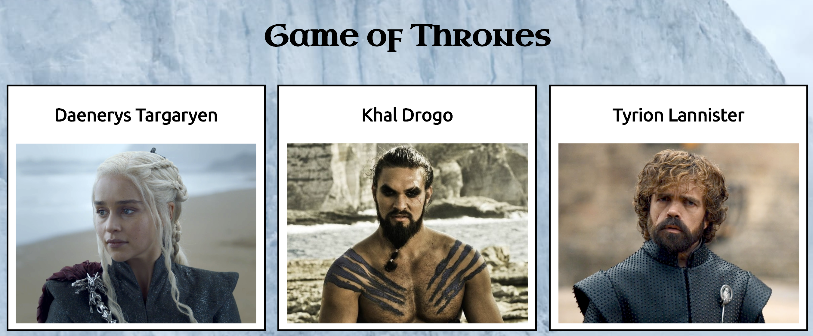

# Game of Thrones Fan Page

You've been tasked with building a Game of Thrones fan page, featuring your
favorite characters and a short bio for each one. You can't truly honor the
Queen of Dragons with a static HTML/CSS page. You need to add some
interactivity!

## Prerequisites

- The DOM
- Events and event listeners

## Instructions

1. Fork and clone this repository.
2. Change into the new directory.
3. Fulfill the listed requirements.

Please turn in your submission by the deadline on your cohort calendar.

## Requirements

The starter code has been provided for you. `index.html` and `style.css`
include the initial structure and styling.

In `script.js`, you will find an array of objects with each character's name
and bio.

You will need to modify the HTML, CSS, and JS to complete the requirements.
Think about the problem you are solving in each step, and make use of the
features of all three.

1. Add a button to each character's `
` with the class `more-info`. When the
   user clicks the button, the name of the character prints to the console.
2. Add more functionality to the button: when clicked, the bio of the character
   appears beneath their image. HINT: Use css `{visibility: hidden}`
4. Add another button to each character's `
` with the class
   `alive-or-dead` by changing the CSS `{opacity: __ }` (or, if you are willing to experiment, the `{filter: blur(__px)}` property).

## Bonus

- Create a button that, when clicked, arranges all characters in alphabetical
  order.

- Create another button that randomly shuffles the characters.

- Create the HTML elements for each character completely in Javascript and
  append them to the `
` element.

## Plagiarism

Take a moment to refamiliarize yourself with the
[Plagiarism policy](https://git.generalassemb.ly/DC-WDI/Administrative/blob/master/plagiarism.md).
Plagiarized work will not be accepted.

## [License](LICENSE)

1.  All content is licensed under a CC­BY­NC­SA 4.0 license.
1.  All software code is licensed under GNU GPLv3. For commercial use or
    alternative licensing, please contact legal@ga.co.
